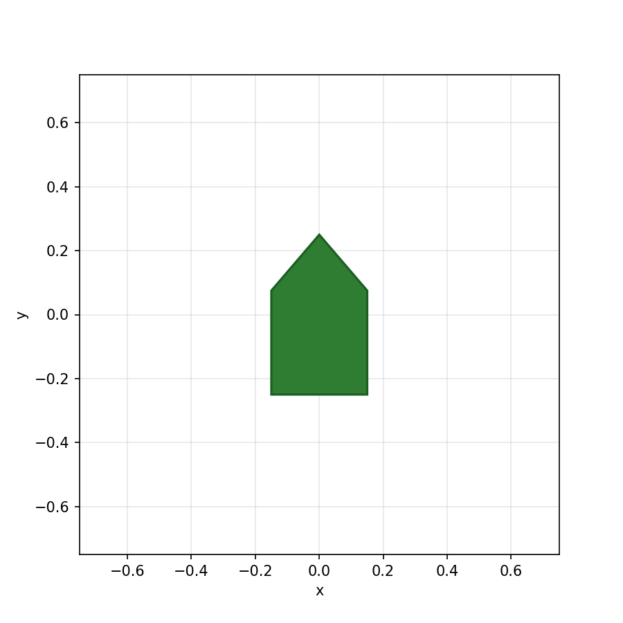
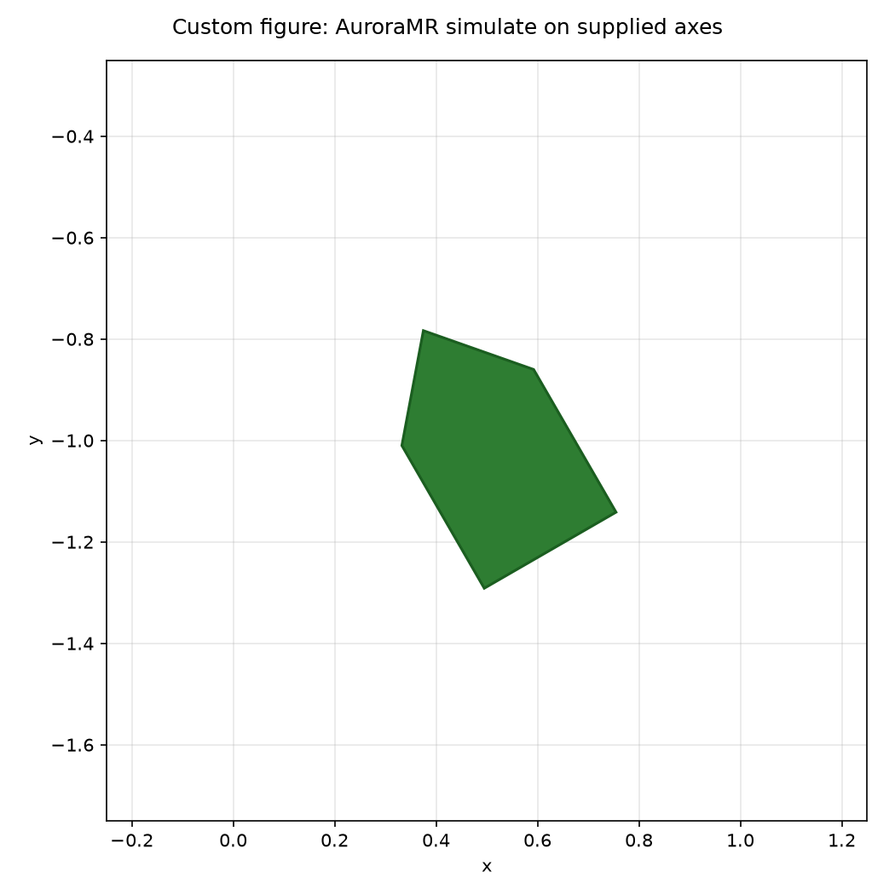
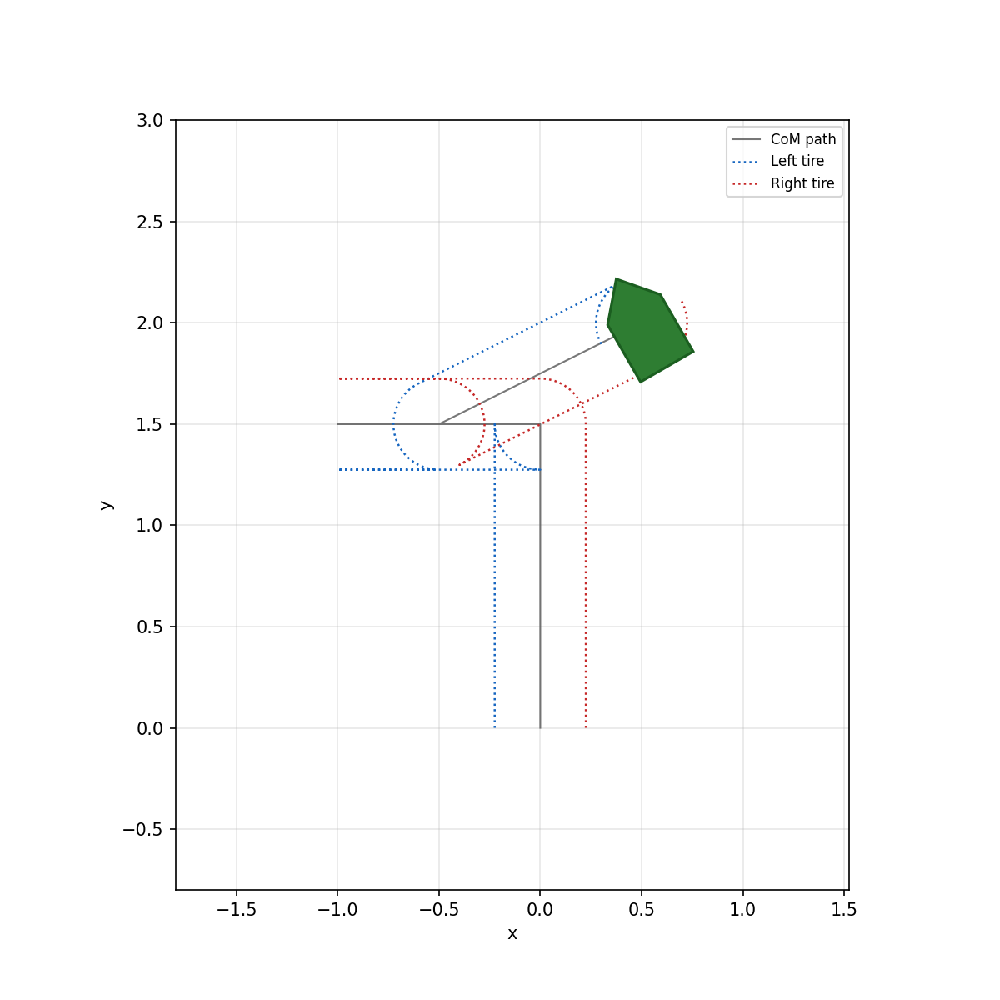
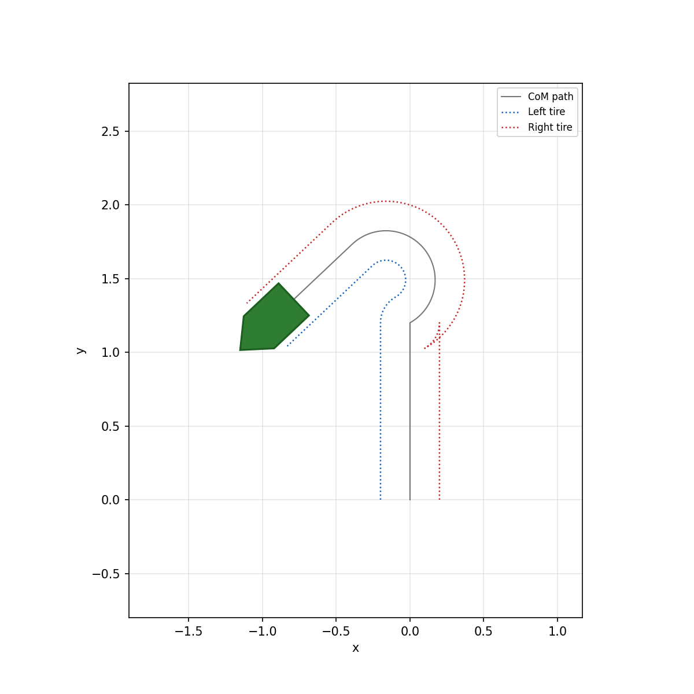
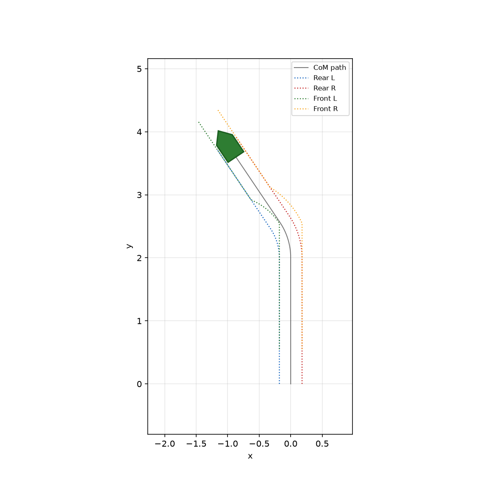
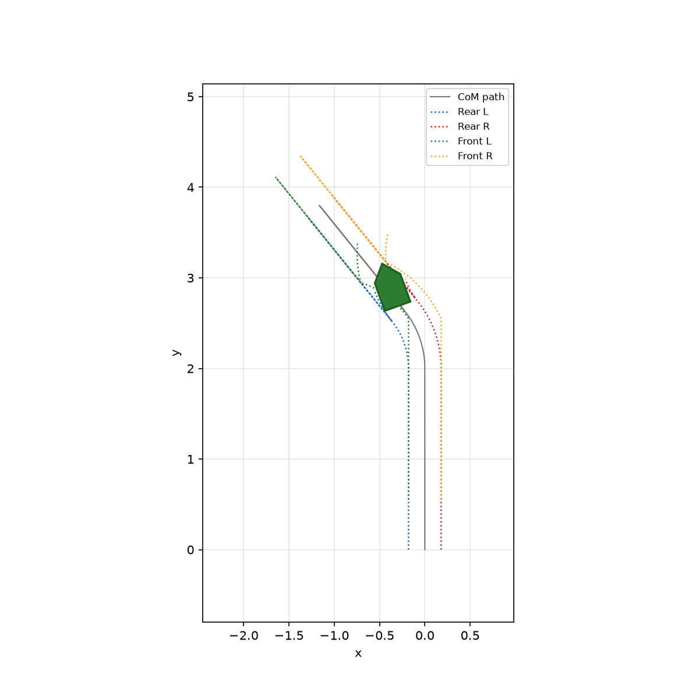
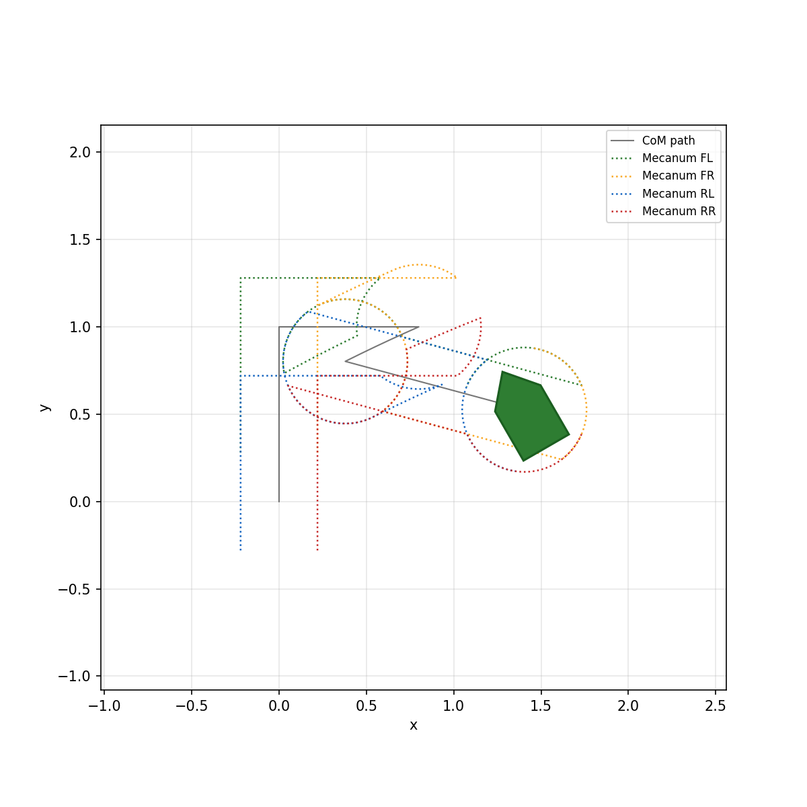

# AuroraMR Simulation Scripts

This repository contains Python scripts for simulating and visualizing Autonomous Mobile Robots (AMRs) using the **AuroraMR (`amr`)** library. It covers basic coordinate systems, managing multiple robot figures, and controlling both **Differential Drive** and **Ackermann** steering setups.

---

## Requirements

```bash
pip install AuroraMR matplotlib
```

---

## 🧭 System Rules & Coordinate Setup

* **0 Radians (0)**: Points straight **North** (+y).
* **Positive Rotation**: Turning is **Counterclockwise** (turning left increases the angle).

| Direction | Angle in Radians | Direction Vector |
| :--- | :--- | :--- |
| **North** | 0 | Facing Upwards |
| **West** | π/2 | Facing Left |
| **South** | π | Facing Downwards |
| **East** | 3π/2 (or −π/2) | Facing Right |

---

## 💻 Script Reference

### 1. Basic Positions (`pose_basics.py`)
This script introduces how to create points on a map using x, y, and an angle (theta).

```python
from __future__ import annotations # Stops Python from panicking if a class name is used early
import math # Unlocks math tools like pi
import AuroraMR as amr # Unlocks the robot toolset

# Create a position: X=1.5, Y=-0.5, Angle=pi/6
p = amr.pose(1.5, -0.5, math.pi / 6)
print("pose() ->", p)
print("  x =", p.x, "  y =", p.y, "  theta (rad) =", p.theta)

# Define standard directions
north = amr.pose(0, 0, 0)
west = amr.pose(0, 0, math.pi / 2)
```

### 2. Plotting Fleet Poses (`simulate_multiple_poses.py`)

This script takes an array of robots and shows how to draw them together on a single map, or separate them into mini-plots side-by-side.

```python
import math
import matplotlib.pyplot as plt # Unlocks the map drawing visualizer
import AuroraMR as amr

poses = [
    amr.pose(0.0, 0.0, 0.0),          # Facing North
    amr.pose(2.5, 1.0, math.pi / 2),  # Facing West
    amr.pose(-1.0, 2.0, math.pi),     # Facing South
]

# --- Approach A: All robots on ONE shared map ---
fig1, ax1 = plt.subplots(figsize=(8, 8))
for p in poses:
    amr.simulate(p, ax=ax1, show=False, length=0.45, width=0.28) # Draws them together

# --- Approach B: One mini-graph subplot per robot ---
fig2, axes = plt.subplots(1, len(poses), figsize=(4 * len(poses), 4))
for ax, p in zip(axes, poses):
    amr.simulate(p, ax=ax, show=False) # Draws them on separate mini-maps
    ax.set_title(f"({p.x:.1f}, {p.y:.1f}), θ={p.theta:.2f}")

plt.show() # Pops open the actual image window on your desktop
```

### 3. Differential Drive Simulation (`differential.py`)

Simulates a classic two-wheel robot setup controlled by manipulating left and right wheel speeds.

```python
import math
import os # Unlocks tools to talk directly to your computer system
import matplotlib.pyplot as plt
import AuroraMR as amr

# Force graphs to draw invisibly in the background (good for cloud/servers)
os.environ.setdefault("MPLBACKEND", "Agg")

s = amr.MotionSession.create(
    amr.pose(0, 0, 0),
    amr.KinematicsModel.DIFFERENTIAL, # Selects two-wheel logic
    dt=0.02, # Time interval between calculations
    differential=amr.DifferentialParams(track_width=0.4, max_wheel_speed=2.0),
)

# Command actions
s.forward_wheels(1.0, 1.0) # Move forward 1 meter
s.turn_left(math.pi / 4, 1.0)
s.forward_wheels(2.0, 0.8)

# Run animation and print statistics to terminal
amr.play_motion(s, interval_ms=30, log=True, log_every_n_frames=10, show=True)
```

### 4. Ackermann Steering Simulation (`Ackermann.py`)

Simulates a car-like steering vehicle layout (four wheels, front steering axle, rear driving axle).

```python
import math
import os
import matplotlib.pyplot as plt
import AuroraMR as amr

os.environ.setdefault("MPLBACKEND", "Agg")

s = amr.MotionSession.create(
    amr.pose(0, 0, 0),
    amr.KinematicsModel.ACKERMANN, # Selects car-steering logic
    dt=0.02,
    ackermann=amr.AckermannParams(wheelbase=0.55, track_width=0.35, max_steering_angle=0.5, max_speed=1.0),
)

# Drive actions
s.forward(1.0, 0.5)
s.turn_left(math.radians(30), 0.6) # Turns left 30 degrees
s.backward(2.6, 1)

# Generate and save map layout image directly to a folder
fig, ax = plt.subplots(figsize=(5, 5))
amr.plot_motion(s, ax=ax, show=False)
fig.savefig(os.path.join(os.path.dirname(__file__), "class_ackermann.png"), dpi=120)

amr.play_motion(s, interval_ms=30, log=True, log_every_n_frames=10, show=True)
```

### 5. Simple Action Pattern Loop (`try.py`)

Runs a quick repetitive pattern sequence using standard motion controls to test paths.

```python
import math
import AuroraMR as amr

s = amr.MotionSession.create(amr.pose(0, 0, 0), amr.KinematicsModel.TWO_WHEEL, dt=0.02)

# Runs a repeated pattern sequence of driving forward and pivoting left
s.forward(0.8, 0.5)
s.turn_left(math.pi / 3, 0.9)
s.forward(0.4, 0.5)
s.forward(0.8, 0.5)
s.turn_left(math.pi / 3, 0.9)
s.forward(0.4, 0.5)

# Visualizes the run session path
amr.play_motion(s, interval_ms=30, log=True, log_every_n_frames=10, show=True)
```# AuroraMR (AMR-lib)

**AuroraMR** is a Python library for **2D autonomous mobile robotics**: planar poses, kinematic simulation, motion scripting, matplotlib visualization, and optional **terminal “teaching” logs** during live playback. It targets courses, labs, and quick prototyping.

The package is published on PyPI as **`AuroraMR`**; import it as either `import AuroraMR as amr` or `import amr` (same public API).

---

## Features

| Area | What you get |
|------|----------------|
| **Pose** | Immutable `Pose(x, y, theta)` with heading **θ counterclockwise from north** (+y). |
| **Visualization** | `simulate()` draws a robot or pointer at a pose; customizable figure and style. |
| **Kinematics** | Two-wheel \((v,\omega)\), differential drive, Ackermann (4-wheel, rear axle pose), and mecanum (X-config). |
| **Motion** | `MotionSession` records trajectories, wheel contact traces, and supports `forward`, turns, model-specific commands, and `drive_to_pose` (where implemented). |
| **Plots** | Static `plot_motion()` with dotted tire traces; live `play_motion()` animation. |
| **Teaching logs** | Optional formatted logs during playback (`log=True`, `PlaybackLogOptions`, throttling). |

**Dependencies:** Python ≥ 3.10, NumPy, Matplotlib.

---

## Installation

### From PyPI

```bash
pip install AuroraMR
```

### From source (editable, for development)

```bash
git clone https://github.com/YOUR_USERNAME/YOUR_REPO.git
cd YOUR_REPO
# If the Git repo root is this library folder (it contains pyproject.toml), stay here.
# If AuroraMR lives inside a monorepo, cd into the AMR-lib (or equivalent) subfolder first.
python -m venv .venv
source .venv/bin/activate   # Windows: .venv\Scripts\activate
pip install -e ".[dev]"
```

Replace the clone URL with your real GitHub repository after you create it.

---

## Coordinate frame (read this once)

- **World:** \(x\) right, \(y\) up (north).
- **Heading θ:** radians, **counterclockwise from +y** (north).  
  Examples: θ = 0 faces north, θ = π/2 faces west, π faces south, 3π/2 (or −π/2) faces east.

This matches the integration and drawing code throughout the library.

---

## Quick start

```python
import math
import AuroraMR as amr

session = amr.MotionSession.create(
    amr.pose(0.0, 0.0, 0.0),
    amr.KinematicsModel.TWO_WHEEL,
    dt=0.02,
)
session.forward(1.0, 0.5)
session.turn_left(math.pi / 2, 1.0)

amr.plot_motion(session)  # static figure
# amr.play_motion(session, log=True, show=True)  # live animation + terminal logs
```

See `examples/minimal_drive_and_play.py` for a short path with turns, a U-turn, 2× playback, and logging.

---

## Kinematic models (`KinematicsModel`)

| Member | Role |
|--------|------|
| **`TWO_WHEEL`** | Planar two-wheel / \((v,\omega)\) model; left/right traces use `track_width`. (`UNICYCLE` is a legacy alias, same value.) |
| **`DIFFERENTIAL`** | Left/right wheel speeds; uses `DifferentialParams`. |
| **`ACKERMANN`** | Four wheels, pose at rear axle, front steering; `AckermannParams`. |
| **`BICYCLE`** | Legacy name; maps to Ackermann-style parameters via `BicycleParams` → `AckermannParams`. |
| **`MECANUM`** | X-config mecanum at center; `MecanumParams`. |

Parameter dataclasses: `TwoWheelParams` / `UnicycleParams` (same type), `DifferentialParams`, `AckermannParams`, `BicycleParams`, `MecanumParams`.

`KinematicsKind` is kept as an alias of `KinematicsModel` for older code.

---

## Main API (lazy exports)

Access these from `amr` after `import AuroraMR as amr` (or `import amr`):

- **Pose:** `Pose`, `pose`
- **Drawing a single pose:** `simulate`
- **Session & motion:** `MotionSession`
- **Plots:** `plot_motion`
- **Live animation:** `play_motion`, `play_all_kinematics_live`, `play_motion_by_kind`
- **Logging:** `PlaybackLogOptions`, `effective_interval_ms`

Playback helpers accept `interval_ms`, `playback_speed` (effective interval = base / speed), and logging flags such as `log`, `log_every_n_frames`, `log_detailed`, `log_file`.

---

## Examples

The `examples/` directory includes:

- **Basics:** `pose_basics.py`, `simulate_robot_default.py`, `simulate_custom_figure.py`, `simulate_headless_default_figure.py`
- **Motion / kinematics:** `motion_two_wheel_demo.py`, `motion_differential_demo.py`, `motion_ackermann_demo.py`, `motion_mecanum_demo.py`, `motion_bicycle_demo.py`, `minimal_drive_and_play.py`
- **Live demos:** `live_kinematics_demo.py` (CLI: mode, speed, logs, optional save), `live_ackermann_quick.py`, `live_ackermann_session.py`
- **Scratch:** `examples/simple/test.py` — small script for local experiments
- **Teaching / class:** `examples/class/` — numbered short scripts (`01_pose.py` … `08_playback_log.py`); see `examples/class/README.md`
- **Advanced:** `examples/advanced/` — logging tee, `drive_to_pose`, mecanum/differential patterns, 4-model subplot, CSV export, `plot_motion` styling; see `examples/advanced/README.md`

Run from the repo root with `PYTHONPATH=.` or after `pip install -e .` so `AuroraMR` resolves.

**Headless environments:** set `MPLBACKEND=Agg` if you do not have a display (saving figures only). Interactive `play_motion(..., show=True)` needs a GUI backend.

### Example gallery (static PNGs)

These images are produced by the matching scripts (same base name, `.py` → `.png`). They use the **world frame** (\(x\) right, \(y\) up), **θ** counterclockwise from north, the robot outline, and (for motion demos) **dotted tire-contact traces** along the path.

#### `simulate_headless_default_figure.py` → `headless_default_figure.png`



Single pose, default **robot** polygon from `simulate()` when Matplotlib creates the figure for you. Use this pattern with `MPLBACKEND=Agg` for CI or saved figures without a GUI.

#### `simulate_custom_figure.py` → `custom_figure_example.png`



You supply your own `fig` and `ax`; `simulate(..., ax=ax, show=False)` draws into your layout—handy for dashboards or multi-panel figures.

#### `motion_two_wheel_demo.py` → `motion_two_wheel_demo.png`



**`KinematicsModel.TWO_WHEEL`**: \((v,\omega)\) motion with left/right wheel traces—forward, turn, backward, and `drive_to_pose`.

#### `motion_differential_demo.py` → `motion_differential_demo.png`



**`DIFFERENTIAL`**: wheel-speed commands, straight segments and turns; two drive contact traces.

#### `motion_ackermann_demo.py` → `motion_ackermann_demo.png`



**`ACKERMANN`**: pose at the rear axle, four wheels, Ackermann-style front steering and arcs.

#### `motion_bicycle_demo.py` → `motion_bicycle_demo.png`



**`BICYCLE`** with `BicycleParams`: legacy API that maps to the same four-wheel Ackermann visualization as above.

#### `motion_mecanum_demo.py` → `motion_mecanum_demo.png`



**`MECANUM`**: X-config wheels at the robot center; path includes strafe and rotation; four corner traces.

---

**Regenerate all gallery PNGs** (from the `AMR-lib` folder that contains `pyproject.toml`):

```bash
export MPLBACKEND=Agg PYTHONPATH=.
python examples/simulate_headless_default_figure.py
python examples/simulate_custom_figure.py
python examples/motion_two_wheel_demo.py
python examples/motion_differential_demo.py
python examples/motion_ackermann_demo.py
python examples/motion_bicycle_demo.py
python examples/motion_mecanum_demo.py
```

Live animations and saved **videos** (`*.mp4` / `*.gif` from `live_kinematics_demo.py --save …`) are not shown here; generate them locally if you need clips for talks or docs.

---

## Development & tests

```bash
pip install -e ".[dev]"
# If pytest picks up unrelated plugins (e.g. ROS), disable autoload:
PYTEST_DISABLE_PLUGIN_AUTOLOAD=1 python -m pytest
```

Or use the helper script:

```bash
./scripts/run_tests.sh -q
```

---

## Project layout

```
AMR-lib/
├── pyproject.toml      # package AuroraMR, wheels include amr + AuroraMR
├── amr/                # main package (kinematics, motion, plot, live, playback_log, simulate)
├── AuroraMR/           # thin shim, same API as amr
├── tests/
├── examples/
└── scripts/run_tests.sh
```

---

## Contributing & GitHub

1. Add a **LICENSE** file in the repository root if you have not already (choose MIT, Apache-2.0, etc., and match `pyproject.toml` if you add SPDX metadata later).
2. Push this folder (or the monorepo path you use) to GitHub; point the README clone URL to the real repo.
3. Pull requests: run tests as above; keep examples runnable with documented assumptions (GUI vs headless).

---

## Version

Current version is defined in `pyproject.toml` (`[project].version`).
